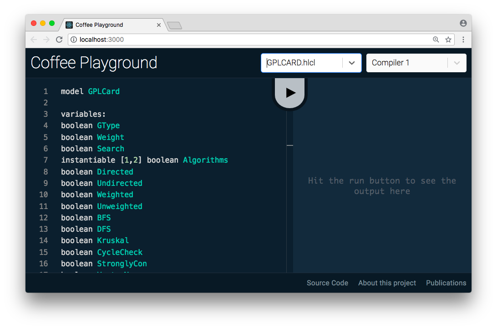

# Coffee Playground

This is a playground to try the Coffee language with different compilers.

### Screenshot



### Running the playground locally

To run and compile this project you need to install [NodeJS](https://nodejs.org) and [yarn](https://yarnpkg.com). You could also use `npm` instead of yarn, which comes with Node.

First, install the dependencies:

```bash
yarn # or npm install
```

And then run the development server:

```bash
yarn start # or npm start
```

### Compiling from sources

First, install the dependencies. Then, generate the production files:

```bash
yarn build # or npm run build
```

The files are generated in the `build` directory.

### Questions?

If you have any questions about the Coffee playground, or something doesn't work as expected, please [submit an issue here](https://github.com/jachinte/coffee-playground/issues/new).
